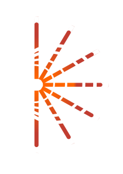

<p align="center" style="color:grey">

 <picture>
    <source media="(prefers-color-scheme: dark)" srcset="./app/public/20250925_logo_dark_rotated_rev01.svg">
    <source media="(prefers-color-scheme: light)" srcset="./app/public/20250925_logo_light_rotated_rev01.svg">
    
  </picture>

<div align="center">
<table>
<tbody>
<td align="center">
<br>

##### `"This app is still in early development but aims to help you organize your files, your emails, and your tasks as efficient as possible."`

   


</td>
</tbody>
</table>
</div>
</p>

# Hestia

> [!IMPORTANT]
> This app is in very early development. I am looking to get a pre-alpha version out soon. Expect
> breaking changes, frequent updates and new features.
> Contributing is welcome!

Hestia is a **cross-platform file management system** that uses intelligent tagging to organize your files without forcing you to reorganize your existing folder structure. **Built with Rust** for speed and security, it features visual thumbnails for images, videos, PDFs, and documents, plus plans for email, password, and task management integration. Designed **offline-first** with cross-device sync capabilities, Hestia keeps your data secure and accessible across Windows, macOS, Linux, and mobile platforms.

## Features

- **Built for Performance, Security and Robustness:** Hestia is designed to keep all your data safe and secure, while not compromising on speed or robustness!
- **Cross-Platform:** Use the app across all your devices using Windows, MacOS, Linux, Android or iOS.
- **Customization, the way you want it:** Customize everything, from the app, using the config file or configuration managers like home-manager!

## Quickstart

Clone the repo, `cd` into the directory, install dependencies via:

```sh
deno install
```

and run:

```sh
deno task tauri dev
```

This should compile the rust code base and start the development server as well as the app itself.

## FAQs

**What is Hestia for?**
Hestia is a file manager first and foremost. I have been looking for a file manager that allows me to save all of my documents, files, sounds, songs and whatever in an easy to access way. Since I could not find what I was looking for, I made my own!

**Why did you decide to use X architecture/language/framework?**
I tried to build the app based on what I believe works best and what I would have the most fun working with. So far I'm pretty happy. If you have suggestions or improvements, open an issue and let's discuss that!

**Are you planning to make money off this?**
Honestly, yes. I don't want to charge people exorbitant amounts of money, but maybe a lifetime purchase for more premium features, with contributors staying free of course.

**Are contributions welcome?**
Yes! Docs, configs, plugins, suggestions—all are valued. Open a PR or issue.

**What do I do, when there is a question that hasn't been answered here?**
Open an issue, write me an email or, if that happens to be useful, I was thinking about opening a discord server. Just let me know!

### Contributing

> Just keep it simple, stupid! -> `kiss` design principle

You’re welcome to contribute in any way!

Please open an issue or PR with your ideas or improvements!

> [!NOTE]
> I am contemplating opening a Youtube Channel once I get around to doing it, where I would also like
> to show off the project. If you are not comfortable with your code or name seen on the channel,
> please let me know!

### License

This project is licensed under the [MIT License](./LICENSE).

### Acknowledgments

- Thanks to all the authors of the projects, libraries and crates that I have had the honour to use in the development of this app.

> [!NOTE]
> I started working Hestia as a personal project, because I didn't find what I wanted with other similar tools.
> If you also happen to find it useful, please consider starring the repository or open a pull request as per the Contributing section!
> Thank you so much for your time!
